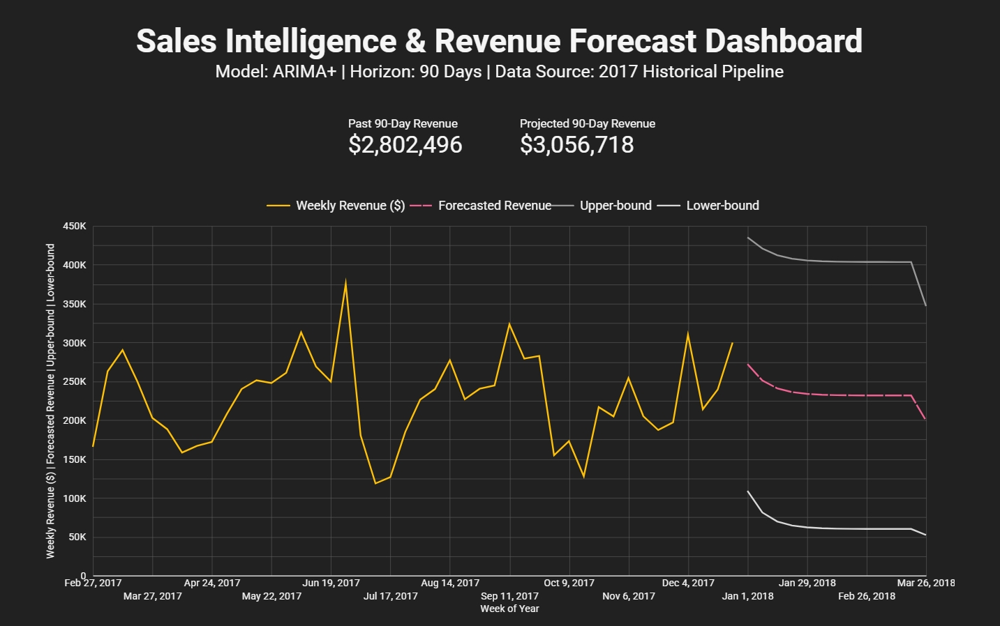

# predictive-sales-forecasting-bqml
End-to-end revenue forecasting engine using BigQuery ML (ARIMA+) and Looker Studio to transform historical CRM data into 90-day predictive insights.
# Predictive Sales Forecasting Engine: BigQuery ML & Looker Studio

## Project Overview
This project focuses on building a robust time-series forecasting model to predict 90-day sales revenue for a B2B organization. By leveraging **BigQuery ML (ARIMA+)**, the solution identifies historical trends and weekly seasonality to provide actionable financial projections, moving beyond static reporting into predictive analytics.

## Tech Stack
* **Data Warehouse:** Google BigQuery
* **Machine Learning:** BigQuery ML (ARIMA_PLUS algorithm)
* **SQL:** Advanced Aggregations, CTEs, and Data Modeling
* **Visualization:** Looker Studio

## Dataset
The raw data used for this project consists of 5 interconnected CSV files located in the `Dataset/` directory:

* **`sales_pipeline.csv`**: Core transaction logs containing opportunity IDs, deal stages, and close values.
* **`accounts.csv`**: Firmographic information including company sector, revenue size, and geographic location.
* **`products.csv`**: A catalog of available products, categorized by series and list price.
* **`sales_teams.csv`**: A mapping of sales agents to their respective regional teams and managers.
* **`metadata.csv`**: The data dictionary and relational mapping file used to join IDs across the disparate tables.

## The Solution
The objective was to transform raw historical sales logs into a 90-day revenue forecast that accounts for market volatility and seasonal patterns.

### 1. Data Preparation
Historical data was aggregated into a time-series format focusing on `close_value` from 'Won' opportunities. Data was cleaned and validated against the `metadata.csv` to ensure chronological consistency for the ARIMA model.

### 2. Predictive Modeling
I utilized the **ARIMA+ (Auto-Regressive Integrated Moving Average)** model in BigQuery:
* **Seasonality:** The model automatically detected weekly "sawtooth" patterns, accounting for weekend dips and mid-week surges.
* **Horizon:** A 90-day forecast was generated with a 95% confidence interval.
* **Anomaly Detection:** Built-in outlier handling ensured that one-off massive deals did not skew the long-term trend.

### 3. Business Visualization
A dynamic Looker Studio dashboard was developed to bridge the gap between complex ML outputs and executive decision-making:
* **Actual vs. Forecast:** A continuous timeline showing historical performance vs. predicted future.
* **Confidence Envelopes:** Shaded regions illustrating "Pessimistic" and "Optimistic" scenarios to help stakeholders manage risk.
#### Looker Studio Dashboard

> Full dashboard --> ["Here!"](https://lookerstudio.google.com/reporting/1afc1d71-48fa-4ad2-8ea4-dd3febf6cfde)

## Key Results & Insights
* **Projected Growth:** The model identified a **~9.1% revenue growth trend** for the upcoming quarter.
* **Total Forecast:** Projected revenue for the next 90 days is approximately **$3.06M**, compared to $2.8M in the previous period.
* **Reliability:** By utilizing a 95% confidence interval, the business can plan for a "floor" of weekly revenue even in conservative scenarios.

## Repository Structure
* `Dataset/`: Raw CSV datasets and metadata.
* `sql/(01)_data_preparation.sql`: Joins the 5 raw CSV datasets into a master analytics table and aggregates 'Won' deals into a daily revenue time-series.
* `sql/(02)_model_training.sql`: Configures and trains the ARIMA+ machine learning model in BigQuery, detecting seasonality and trends.
* `sql/(03)_forecasting_result.sql`: Generates the raw forecast data for the next 90 days, including confidence intervals (Upper/Lower bounds).
* `sql/(04)_forecasting_view.sql`: Creates the final BigQuery View that cleans and formats the data for seamless integration with the Looker Studio dashboard.
* `Dashboard/`: Screenshot of the final dashboard and forecast charts.

## Business Impact
This engine shifts the sales team from reactive "pipeline watching" to proactive "revenue planning." Executives can now allocate resources, set quotas, and manage cash flow based on statistically grounded projections rather than intuition.

## ⚙️ How to Reproduce
1. Upload the CSV files from the `/data` folder to your BigQuery dataset.
2. Run the SQL scripts in the `sql/` folder sequentially from (01) to (04).
3. Connect the resulting View from script (04) to Looker Studio.
